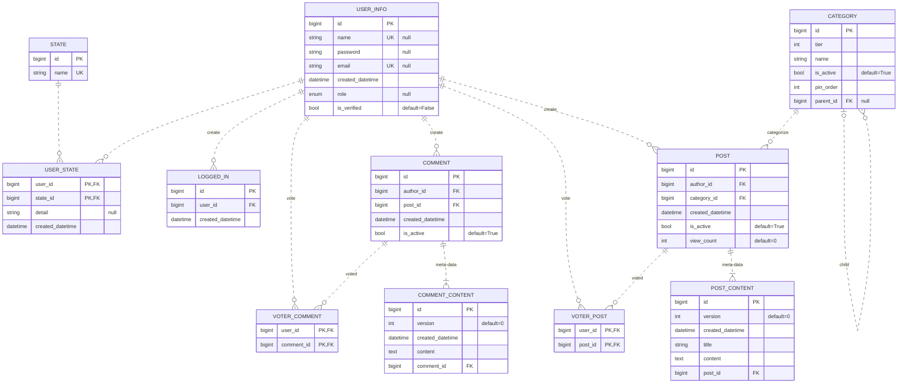

# spring_board

스프링 기반 게시판 서비스

## dependency

- Java 17
- gradle
- check `build.gradle` for other dependency

## utils

- [swagger open-api](http://127.0.0.1:8080/swagger-ui/index.html)

## ERD

```mermaid
erDiagram
    STATE {
        bigint id   PK
        string name UK
    }

    USER_INFO {
        bigint      id                  PK
        string      name                UK  "null"
        string      password                "null"
        string      email               UK  "null"
        datetime    created_datetime
        enum        role                    "null"
        bool        is_verified             "default=False"
    }

    STATE ||..o{ USER_STATE : ""
    USER_INFO ||..o{ USER_STATE : ""
    USER_STATE {
        bigint      user_id             PK, FK
        bigint      state_id            PK, FK
        string      detail                      "null"
        datetime    created_datetime
    }

    USER_INFO ||..o{ LOGGED_IN : create
    LOGGED_IN {
        bigint      id                  PK
        bigint      user_id             FK
        datetime    created_datetime
    }

    USER_INFO ||..o{ VOTER_COMMENT : vote
    COMMENT ||..o{ VOTER_COMMENT : voted
    VOTER_COMMENT {
        bigint user_id      PK, FK
        bigint comment_id   PK, FK
    }

    USER_INFO ||..o{ COMMENT : create
    COMMENT {
        bigint      id                  PK
        bigint      author_id           FK
        bigint      post_id             FK
        datetime    created_datetime
        bool        is_active               "default=True"
    }

    COMMENT ||..|{ COMMENT_CONTENT : meta-data
    COMMENT_CONTENT {
        bigint      id                  PK
        int         version                 "default=0"
        datetime    created_datetime
        text        content
        bigint      comment_id          FK
    }

    CATEGORY |o..o{ CATEGORY : child
    CATEGORY {
        bigint      id          PK
        int         tier
        string      name
        bool        is_active       "default=True"
        int         pin_order
        bigint      parent_id   FK  "null"
    }

    USER_INFO ||..o{ POST : create
    CATEGORY ||..o{ POST : categorize
    POST {
        bigint      id                  PK
        bigint      author_id           FK
        bigint      category_id         FK
        datetime    created_datetime
        bool        is_active               "default=True"
        int         view_count              "default=0"
    }

    USER_INFO ||..o{ VOTER_POST : vote
    POST ||..o{ VOTER_POST : voted
    VOTER_POST {
        bigint user_id PK, FK
        bigint post_id PK, FK
    }

    POST ||..|{ POST_CONTENT : meta-data
    POST_CONTENT {
        bigint      id                  PK
        int         version                 "default=0"
        datetime    created_datetime
        string      title
        text        content
        bigint      post_id             FK
    }
```
